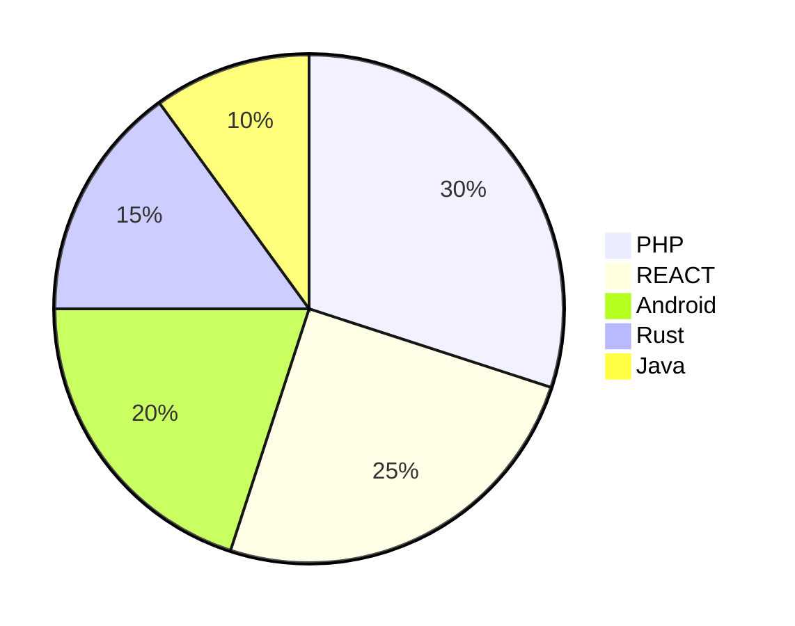

# 👋 Bienvenue sur mon Profil GitHub

<div align="center">
  
</div>

<p align="left"> 
  <!-- Profile views counter -->
   
</p>

<!-- WakaTime Badge -->
<p align="left">
  <a href="https://wakatime.com/@14fe3c61-8f4f-4dd2-b75c-eff28a472911" target="_blank" rel="noreferrer">
    
  </a>
</p>

---

## 💻 Mes compétences techniques

### Langages de programmation


<table>
  <tr>
    <td align="center" width="96">
      
      <br>Java
    </td>
    <td align="center" width="96">
      
      <br>C#
    </td>
    <td align="center" width="96">
      
      <br>JavaScript
    </td>
    <td align="center" width="96">
      
      <br>Python
    </td>
    <td align="center" width="96">
      
      <br>WinDev
    </td>
    <td align="center" width="96">
      
      <br>Blueway
    </td>
  </tr>
</table>

### Frameworks & Outils
<table>
  <tr>
    <td align="center" width="96">
      
      <br>React
    </td>
    <td align="center" width="96">
      
      <br>Docker
    </td>
    <td align="center" width="96">
      
      <br>MySQL
    </td>
    <td align="center" width="96">
      
      <br>GitHub
    </td>
    <td align="center" width="96">
      
      <br>HFSQL
    </td>
  </tr>
</table>

## 🎮 Mes jeux préférés
- 🏆 Mount & Blade
- 🚀 Counter-Strike 2
- 🌍 Minecraft
- 🏹 Undertale
- 🏰 Total war (all)

## 📊 Mes statistiques de code

```java
// Exemple de code Java que j'apprécie
public class CodingHabits {
    public static void main(String[] args) {
        while (true) {
            code();
            if (needCoffee()) {
                drinkCoffee();
            }
            learn();
        }
    }
}
```

```csharp
// Un exemple de code C# qui me représente
public class MyDevelopment
{
    public void CreateSomethingAwesome()
    {
        while (HasIdeas())
        {
            Develop();
            Test();
            Refactor();
            Deploy();
        }
    }
}
```

```windev
// Mon style de code WinDev
PROCEDURE MaFonctionWinDev()
LOCAL maVariable est une chaîne
maVariable = "J'adore coder en WinDev!"
Info(maVariable)
RENVOYER Vrai
```

## 🚀 Mes projets récents
Nop 

## 📫 Comment me contacter
- 📧 Email: hugodemontpro@gmail.com


---
⭐️ De [Hugo Demont](https://github.com/HugoDemont62)

