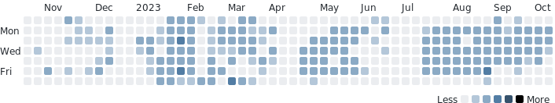

# 👋 Bienvenue sur mon Profil GitHub

 
   

  

## 🛠️ Tech Stack

  
  
  
  
  
  
  
  
  
  

## 🚀 Projets récents

<!-- PROJECTS-START -->
| Projet | Description | Langage | ⭐ | Dernière MàJ |
|--------|-------------|---------|-----|--------------|
| [robot-cool-qui-casse-tout](https://github.com/HugoDemont62/robot-cool-qui-casse-tout) | Code du robot pour l'Eurobot 2026 | `Python` | 0 | 21/03/2026 |
| [DOCorps](https://github.com/HugoDemont62/DOCorps) | — | `JavaScript` | 0 | 20/03/2026 |
| [theland](https://github.com/HugoDemont62/theland) | Site de thé via strapi | `TypeScript` | 0 | 28/02/2026 |
| [workshop-react-natif](https://github.com/HugoDemont62/workshop-react-natif) | Application Chauve map (pour le fun) | `TypeScript` | 0 | 27/02/2026 |
| [mon-site-vr](https://github.com/HugoDemont62/mon-site-vr) | — | `TypeScript` | 0 | 17/01/2026 |

> 🕐 Dernière mise à jour : 22/03/2026 à 07:45 UTC+1
<!-- PROJECTS-END -->

## 📊 GitHub Stats

  

  

  

## 📫 Comment me contacter ?

- 📧 Email: hugodemontpro@gmail.com

---
⭐️ De [Hugo Demont](https://github.com/HugoDemont62)
